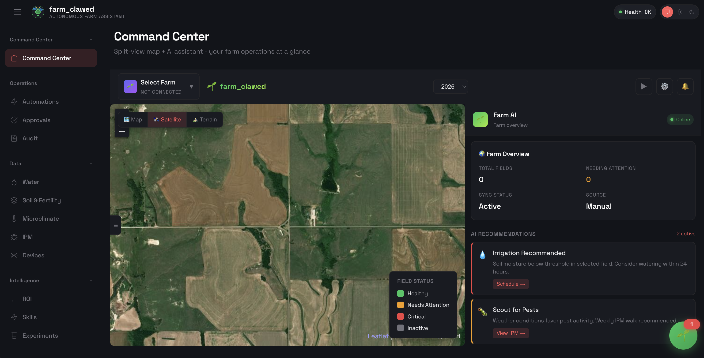

# farm_clawed — AI-first Farm Operator (Permaculture-ready)

<p align="center">
  
</p>

<p align="center">
  <strong>Your autonomous farming assistant that grows with you</strong>
</p>

<p align="center">
  From a single potted lemon to a full permaculture food forest
</p>

<p align="center">
  <a href="https://github.com/rahulraonatarajan/farm_clawed/actions/workflows/ci.yml?branch=main"></a>
  <a href="https://github.com/rahulraonatarajan/farm_clawed/releases"></a>
  <a href="LICENSE"></a>
</p>

**farm_clawed** is an _AI-first farm automation platform_ you run on your own devices. Whether you're nurturing a single container plant or managing a commercial permaculture operation, farm_clawed provides intelligent recommendations, safety-first automation, and ROI tracking.

<p align="center">
  
</p>

<p align="center">
  <em>Farm Map view with AI Insights panel and floating chat assistant</em>
</p>

## Key Features

- **AI-First Interface** — ChatGPT-style conversational UI as your primary farming tool
- **Floating AI Assistant** — Access farm_clawed from any page via the floating chat bubble
- **Day 1 Value** — Works immediately with manual logs and templates, no hardware required
- **Permaculture-Ready** — Native support for zones, sectors, guilds, and succession planning
- **Safety-First Automation** — Toyota-style Jidoka principles for physical automation
- **Local LLM Support** — Run with Ollama for privacy and offline operation
- **Interactive Farm Map** — Satellite, terrain, and default map layers with asset overlays
- **Scale Smoothly** — From container gardening to commercial operations

## What's New

### Conversational Dashboard
The farm_clawed dashboard is designed like ChatGPT — your AI assistant is the interface, not just a feature. Ask questions, get sensor cards, approve automations, all in a natural conversation flow.

### Floating Chat Bubble
Access farm_clawed from anywhere in the app. The floating 🌱 button in the bottom-right corner opens a quick chat panel with full context awareness of what you're viewing.

### Farm Map View
Full-screen interactive map with:
- **Default/Satellite/Terrain** layer switching
- **AI Insights** floating panel
- **Pending Automations** overlay
- **Asset markers** with status colors

### Local LLM with Ollama
Run farm_clawed completely offline with Ollama:
```bash
# Install Ollama
brew install ollama

# Pull a model
ollama pull llama3.2

# farm_clawed auto-detects Ollama on localhost:11434
```

## Choose Your Path

### Permaculture Depth (0-3)

| Level | Name | What You Get |
|-------|------|--------------|
| 0 | Standard | Conventional farm ops, fields/blocks/irrigation zones |
| 1 | Regen-Friendly | Soil health focus, water conservation, IPM basics |
| 2 | Permaculture-Lite | Optional zones/sectors, guild guidance |
| 3 | Full Permaculture | Complete zones/sectors, guilds, stacking, succession |

### Automation Level (0-4)

| Level | Name | Control Style |
|-------|------|--------------|
| 0 | Observe | Dashboards and logs only |
| 1 | Assist | AI recommendations + checklists |
| 2 | Propose | Human-in-loop approvals (default) |
| 3 | Auto-Guardrails | Automatic within safety limits |
| 4 | Full Ops | Hardware integration with strict Jidoka |

## Quick Start

### AI-Only Day 1 (No Hardware)

Get started in 5 minutes with AI recommendations based on your manual inputs:

```bash
# Install
npm install -g farm_clawed@latest

# Initialize your farm context
farm_clawed farm init

# Answer the setup wizard questions about your farm
# Then get your first AI analysis:
farm_clawed farm schedule run
```

### Run the Lemon Tree Experiment

See farm_clawed in action with our flagship demo:

```bash
# Start the gateway
farm_clawed gateway --port 18789

# Open the web UI
open http://localhost:18789

# Navigate to Farm tab to see the dashboard
```

The experiment demonstrates:
- Real sensor data (Tuya/SmartLife soil sensor)
- AI-driven watering recommendations
- Safety guardrails in action
- ROI tracking from day 1
- How a single plant scales to an orchard

## Installation

**Runtime:** Node 22+

```bash
# npm
npm install -g farm_clawed@latest

# pnpm
pnpm add -g farm_clawed@latest

# Run onboarding
farm_clawed onboard --install-daemon
```

## From Source (Development)

```bash
git clone https://github.com/rahulraonatarajan/farm_clawed.git
cd farm_clawed

pnpm install
pnpm ui:build
pnpm build

pnpm farm_clawed onboard --install-daemon
```

## Configuration

Minimal `~/.farm_clawed/farm_clawed.json`:

```json5
{
  farm: {
    permacultureDepth: 1,  // 0-3
    automationLevel: 1,    // 0-4
  },
  agent: {
    model: "ollama/llama3.2",  // local LLM
  },
}
```

### Environment Variables

```bash
# Optional: AI provider (works without, uses Ollama by default)
AI_PROVIDER=local  # or openai, anthropic, none

# Optional: Cloud AI (if not using Ollama)
AI_API_KEY=sk-...

# Optional: IFTTT for actuator control
IFTTT_WEBHOOK_KEY=your-key
```

## Farm Context Pack

farm_clawed uses a simple template system to understand your farm:

### Core Templates (Required)

| File | Purpose |
|------|---------|
| `farm_profile.yaml` | Location, climate, constraints |
| `farm_map.geojson` | Areas/fields/zones as polygons |
| `water_assets.csv` | Water sources, valves, sensors |
| `roi_inputs.yaml` | Cost tracking configuration |
| `sensor_readings.csv` | Manual or imported sensor data |
| `season_calendar.yaml` | Planting windows, frost dates |

### Permaculture Extensions (Depth 2+)

| File | Purpose |
|------|---------|
| `zones_0_5.geojson` | Permaculture zone boundaries |
| `sectors.yaml` | Sun, wind, water flow analysis |
| `guilds.yaml` | Plant guild definitions |
| `succession_plan.yaml` | Multi-year succession stages |
| `water_budget.yaml` | Drought stages and priorities |

See [docs/FARM_CONTEXT_PACK.md](docs/FARM_CONTEXT_PACK.md) for complete specifications.

## CLI Commands

```bash
# Farm management
farm_clawed farm init           # Initialize farm context
farm_clawed farm status         # Show current status
farm_clawed farm schedule run   # Trigger AI analysis

# Approvals and safety
farm_clawed farm approve <id>   # Approve pending action
farm_clawed farm audit          # View audit log

# Export and reporting
farm_clawed farm export         # Export data/reports
farm_clawed farm roi            # Show ROI dashboard
```

## Safety/Jidoka System

farm_clawed implements Toyota-style autonomation for physical automation:

### Stop-the-Line Triggers

- **Leak Detection** — Flow without valve open command
- **Overwatering** — Moisture > threshold for too long
- **EC Spike** — High EC combined with dry soil
- **Frost Risk** — Soil temperature dropping rapidly

### Audit Chain

Every action is logged with SHA256 hash chain for tamper-evident history.

### Approval Levels

- **Level 0-2:** All actuator actions require human approval
- **Level 3:** Automatic within guardrails, alerts on anomalies
- **Level 4:** Full automation with strict Jidoka and incident runbooks

## Hardware Integration (Optional)

### Supported Devices

- **Tuya/SmartLife** — Soil sensors, valve controllers
- **IFTTT Webhooks** — Scene-based actuation
- **Home Assistant** — Bridge stub (coming soon)

### Scene Convention

```
FARM_LEMON_WATER_1MIN
FARM_LEMON_WATER_2MIN
FARM_LEMON_WATER_5MIN
FARM_LEMON_WATER_10MIN
FARM_ALL_OFF
```

See [docs/IFTTT_SMARTLIFE_SETUP.md](docs/IFTTT_SMARTLIFE_SETUP.md) for setup guide.

## ROI Tracking

farm_clawed tracks return on investment across:

- **Water Savings** — Gallons saved vs baseline
- **Time Savings** — Hours freed per week
- **Avoided Loss** — Prevented plant death/damage
- **Input Savings** — Reduced fertilizer waste
- **Payback Period** — Months to recover equipment cost

ROI adapts to your chosen permaculture depth and automation level.

## Tool Ladder

| Tier | Tools | Value |
|------|-------|-------|
| 0 | AI console (free) | Time saved, better decisions |
| 1 | Paid AI models | Higher quality recommendations |
| 2 | Workflows | Automated scheduling |
| 3 | Custom skills | Domain-specific knowledge |
| 4 | Local LLM | Privacy + cost savings |
| 5 | Full hardware | End-to-end automation |

## Architecture

```
farm_clawed/
├── src/farm/              # Farm-specific logic
│   ├── schemas/           # Zod validation schemas
│   ├── safety/            # Jidoka implementation
│   ├── ai/                # Provider abstraction
│   └── roi/               # ROI calculator
├── skills/
│   ├── farm-standard/     # Standard farm skills
│   └── farm-permaculture/ # Permaculture skills
├── extensions/
│   └── ifttt-smartlife/   # Optional actuator connector
└── ui/src/ui/
    ├── views/
    │   ├── farm-dashboard.ts     # ChatGPT-style AI interface
    │   ├── farm-map-dashboard.ts # Full-screen map with overlays
    │   ├── farm-equipment.ts     # Equipment management
    │   └── farm-automations.ts   # Automation history
    └── components/
        └── chat-bubble.ts        # Floating AI assistant
```

See [docs/ARCHITECTURE_REVIEW.md](docs/ARCHITECTURE_REVIEW.md) for details.

## Documentation

- [Architecture Review](docs/ARCHITECTURE_REVIEW.md)
- [Farm Context Pack](docs/FARM_CONTEXT_PACK.md)
- [IFTTT/SmartLife Setup](docs/IFTTT_SMARTLIFE_SETUP.md)
- [Template Examples](docs/TEMPLATES/)

## Flagship Experiment: Santa Teresa Lemon Tree

Our live demo showcases farm_clawed managing a containerized Meyer Lemon:

**Hardware:**
- SmartLife/Tuya Valve Controller 2 + Gateway
- Tuya Solar Soil Sensor (Moisture + Temp + EC)

**Day 1 Readings:**
- Moisture: 17%
- Soil Temp: 54.5°F
- EC: 0.001 mS/cm
- Battery: 57%

**Route:** `/farm` (Dashboard) or `/farm/map` (Map View)

This experiment demonstrates how the same system scales from a single container plant to an entire orchard or farm.

## Contributors

farm_clawed is built on the shoulders of giants:

- **[Peter Steinberger](https://github.com/steipete)** — Creator of [OpenClaw](https://github.com/openclaw/openclaw), the powerful AI platform that farm_clawed is built upon
- **[Rahul Rao Natarajan](https://github.com/rahulraonatarajan)** — farm_clawed fork maintainer, autonomous farming features

We welcome contributions from farmers, developers, and permaculture enthusiasts! See [CONTRIBUTING.md](CONTRIBUTING.md) for guidelines. Thank you

## License

MIT License — see [LICENSE](LICENSE) for details.

This project is open source to ensure farmers everywhere can benefit from AI-assisted automation. Commercial use, modification, and distribution are all permitted under the MIT license.

---

<p align="center">
  <strong>farm_clawed</strong> — Growing smarter, together. 🌱
</p>
